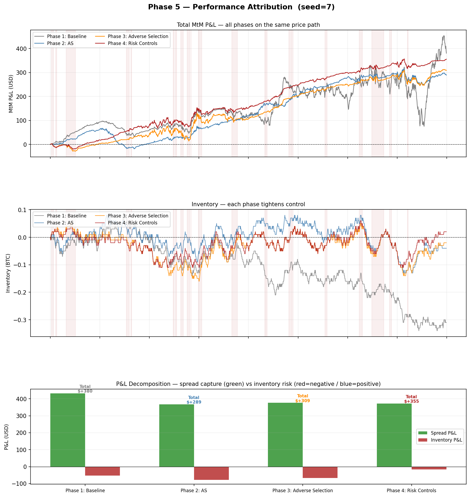

# Market Making Simulator

**NUS MComp General Track Capstone Project**

A Python simulator that builds a market maker from scratch on real and synthetic BTC price data, progressively improving from a naive fixed-spread baseline to a full risk-controlled Avellaneda-Stoikov model — with VPIN adverse selection detection and GARCH(1,1) dynamic volatility.

---

## Motivation

A market maker profits by posting both a bid and an ask simultaneously, earning the spread on each round trip. The challenge: inventory accumulates when one side fills more than the other, and if the price moves against that position, directional losses can exceed all spread gains.

This project demonstrates — step by step — how each model improvement addresses a specific failure mode, using BTC as the test asset (24/7, ~80% annual vol, inventory risk immediately visible).

---

## Progression

| Phase | Model | Key Idea | Weakness Fixed |
|-------|-------|----------|----------------|
| 1 | Baseline | Fixed spread `bid = mid − δ`, `ask = mid + δ` | — |
| 2 | Avellaneda-Stoikov | Reservation price skews quotes toward inventory reduction | Inventory drift |
| 3 | Adverse Selection | Toxicity score widens spread when informed flow detected | Adverse selection loss |
| 4 | Risk Controls | Hard inventory cap + vol regime + emergency liquidation | Unbounded risk |
| 5 | Attribution | All models compared on the same price path | — |
| 6 | Monte Carlo | 500-path statistical validation, cross-path Sharpe ratio | Single-path luck |
| 7 | Real Data | Binance API — real BTC/USDT 1-min data, 7-day backtest | Simulation assumptions |
| 8 | VPIN | Volume-synchronized toxicity detection (Easley et al. 2012) | Price-only toxicity |
| 9 | GARCH | GARCH(1,1) dynamic sigma replaces fixed vol in AS formula | Constant volatility |

---

## Results

**Phase 5 Attribution — all models on the same price path:**



| Model | Spread P&L | Inventory P&L | Total P&L | Max Drawdown | Inv Std Dev |
|-------|-----------|---------------|-----------|-------------|-------------|
| Phase 1: Baseline | +$432 | −$52 | +$380 | $0 | 0.100 BTC |
| Phase 2: AS | +$367 | −$79 | +$289 | −$18 | 0.043 BTC |
| Phase 3: Adverse Selection | +$376 | −$68 | +$309 | −$29 | 0.046 BTC |
| Phase 4: Risk Controls | +$372 | −$17 | **+$355** | −$20 | **0.036 BTC** |

Phase 4 achieves the tightest inventory control while maintaining spread P&L close to the baseline.

---

## Quick Start

```bash
git clone https://github.com/YouLi128/market-making-sim.git
cd market-making-sim
pip install -r requirements.txt

# Run each phase
python run_baseline.py          # Phase 1
python run_as.py                # Phase 2
python run_compare.py           # Phase 1 vs 2 comparison
python run_phase3.py            # Phase 3
python run_phase4.py            # Phase 4
python run_attribution.py       # Phase 5 — all models
python run_montecarlo.py        # Phase 6 — 500-path Monte Carlo
python run_real_data.py         # Phase 7 — real BTC data (latest day)
python run_realdata_backtest.py # Phase 7 — 7-day real data backtest
python run_vpin.py              # Phase 8 — VPIN vs simple toxicity
python run_garch.py             # Phase 9 — GARCH dynamic vol
```

Each script saves a `.png` plot and prints a summary table to the console.

**Common flags:**
```bash
python run_baseline.py --seed 7           # different random path
python run_baseline.py --delta 25         # tighter spread
python run_phase4.py --max-inventory 0.05 # stricter inventory cap
python run_attribution.py --no-show       # save PNG without opening window
```

---

## File Structure

```
market-making-sim/
├── simulator/
│   ├── data_gen.py              # GBM + regime-switching price generator
│   ├── baseline_mm.py           # Phase 1: fixed-spread market maker
│   ├── avellaneda_stoikov.py    # Phase 2: AS model
│   ├── adverse_selection.py     # Phase 3: toxicity detection
│   ├── risk_controls.py         # Phase 4: hard limits + vol regime
│   └── visualize.py             # all plotting functions
├── run_baseline.py              # Phase 1 entry point
├── run_as.py                    # Phase 2 entry point
├── run_compare.py               # Phase 1 vs 2 comparison
├── run_phase3.py                # Phase 3 entry point
├── run_phase4.py                # Phase 4 entry point
├── run_attribution.py           # Phase 5 — full comparison
├── PROJECT.md                   # detailed bilingual documentation
└── requirements.txt
```

---

## Key Concepts

**Reservation Price (AS Model)**
```
r = mid − γ · q · τ
```
When inventory `q > 0` (long), `r < mid` → ask moves closer to mid → sell orders fill more readily → inventory mean-reverts.

**Toxicity Score (Phase 3)**
```
toxicity = |fraction_of_up_moves_in_window − 0.5| × 2
```
Near 0 = random flow (safe). Near 1 = strongly directional (informed traders likely active → widen spread).

**Emergency Liquidation (Phase 4 — BTC-appropriate)**

Triggers when:
- Same-side inventory held > 120 minutes, OR
- Inventory floating loss exceeds −$150

On trigger: `γ_eff = γ × 5` — reservation price pushed hard away from mid, making it cheap for the market to take the inventory off.

---

## Stack

Python · NumPy · pandas · Matplotlib

---

## References

Avellaneda, M. & Stoikov, S. (2008). *High-frequency trading in a limit order book*. Quantitative Finance, 8(3), 217–224.
